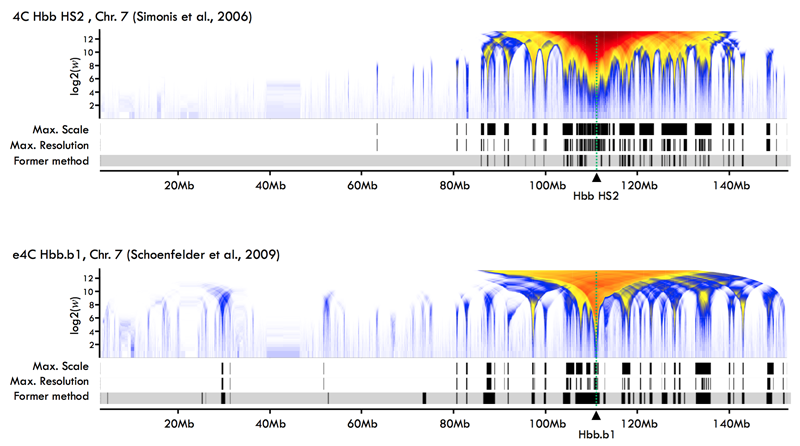

Chromosome Conformation Capture on Chip (4C): Data Processing
================================================================================

### Overview ###

This repository contains a collection of `bash` and `R` scripts that were
developped to analyze Chromosome Conformation Capture on Chip (4C) data,
meaning the microarray version of 4C which was employed in early genomic
studies of chromosome conformation.

The data analysis workflow consists in improved versions of procedures we
used in [Bantignies et al., 2011](#1), with methods addressing the selection
and normalization of microarray probes, and the multi-resolution visualization
and segmentation of 4C profiles, and which are directly accessible in the
standalone R package [MRA.TA](https://github.com/benja0x40/MRA.TA). 

A detailed presentation of these methods as well as a brief introduction to
the microarray version of the 4C technique itself can be found in
[Leblanc et al., 2016](#2).
To put this in the perspective of current Chromosome
Conformation Capture (3C) methods and applications, one can for instance read the
review from [Denker & de Laat, 2016](#3).

### Examples ###

The figure below shows results produced using the `MiMB.4C` workflow, based
on 4C data in mouse from [Simonis et al., 2006](#4) (top panel) and
[Schoenfelder et al., 2009](#5) (bottom panel).



Each panel represents the mouse chromosome 7 on the horizontal axis and the
resolution of analysis on the vertical axis, in number of microarray probes
(_w_).
In both studies the 4C "bait" or "anchor" sequence was targeting
the beta globin locus (**Hbb**, dotted green line).

The frequencies of interactions between the Hbb locus and remote locations along
the chromosome are indicated by colors, from light blue for the weakest levels
to dark red for the strongest ones.
More precisely, these colormaps represent a statistical score at each genomic
location and considering resolutions of analysis ranging from one to
approximately 5000 microarray probes.

The 3 tracks below each colormap show alternative segmentations of the
most significant interactions, indicating from top to bottom:  
- a segmentation at maximal scale and at maximal resolution resulting from our
protocol.  
- the segmentation reported in the original study using former data
analysis methods.

A demo analysis with 4C data in *Drosophila* anterior larval tissues
from [Bantignies et al., 2011](#3) can be run as indicated in the
following sections.

### Quick start ###

1. Run the R code below to install the
[MRA.TA](https://github.com/benja0x40/MRA.TA) package.  
If the installation fails, try to install dependencies manually as indicated
in the next section.

```R
library("devtools")
install_github("benja0x40/MRA.TA")
```

2. Clone or download and decompress the `MiMB.4C` repository.

3. Run the demo in a terminal (`bash`), with current working directory at the
root of the decompressed `MiMB.4C` folder.

```bash
./dataPreparation.sh
Rscript enrichmentAnalysis.R
```

### Dependencies ###

  - `bowtie` short read aligner version 1.x (http://bowtie-bio.sourceforge.net)
  - [R environment](https://www.r-project.org/) version 3.x
  - CRAN packages `devtools`, `stringr`, `getopt`, `plotrix`
  - [Bioconductor](http://www.bioconductor.org/) packages
    `Biostrings`, `GenomicRanges`
  - GitHub `R` package [MRA.TA](https://github.com/benja0x40/MRA.TA)

Run the `R` code below to install CRAN, Bioconductor and GitHub package
dependencies for `MiMB.4C`.

```R
# Already installed
pkg <- installed.packages()[, "Package"]

# CRAN packages
lst <- c("devtools", "stringr", "getopt", "plotrix")
lst <- setdiff(lst, pkg)
if(length(lst) > 0) install.packages(lst, repos = "https://cloud.r-project.org/")

# Bioconductor packages
lst <- c("Biostrings", "GenomicRanges")
lst <- setdiff(lst, pkg)
if(length(lst) > 0) {
  source("https://bioconductor.org/biocLite.R")
  biocLite(lst)
}

# GitHub package
library("devtools")
install_github("benja0x40/MRA.TA")
```

### Content of MiMB.4C ###

#### 1. Bash scripts ####

  * `importGenome.sh`
  
    Tool to download a genome sequence from UCSC and create its `bowtie` index.
  
  * `importRawData.sh`
  
    Tool to download the demo 4C data from GEO.
  
  * `dataPreparation.sh`
  
    Workflow script to be executed first when running the demo analysis.
    This script chains several operations:
    importing genome sequence and raw data, updating micro array design probes
    to the lastest (dm6) genome assembly, filtering out non-experimental probes,
    mapping bait sequence (Fab7) to the genome, and computing the restriction
    map associated to the 4C protocol (DpnII).
  
#### 2. R scripts ####

  * `updateDesignData.R`
  
    Tool to update micro array design information for any genome release.
    This tool uses `bowtie` to map probe sequences on a chosen genome assembly 
    and updates genomic coordinates addressed by the microarray platform
    accordingly.
    
  * `computeRestrictionMap.R`
  
    Tool to compute the genomic coordinates of all restriction sites for a given
    restriction enzyme. Restriction sites are defined by the short DNA motif,
    commonly 4 to 6bp in 4C protocols, specifically targeted by the enzyme.
  
  * `enrichmentAnalysis.R`
  
    Workflow R script to be executed secondly (after `dataPreparation.sh`) when
    running the demo analysis.
    This script chains normalization, probes filtering and multi-resolution
    analysis of the 4C enrichments.
    
    For further details see [Leblanc et al., 2016](#2).
  
#### 3. File organisation (before execution) ####

    4C_Bait_Sequences => Fasta file of 4C bait sequence and its bowtie alignments
    Experiment_Design => Tables defining necessary 4C experiment data annotations

#### 4. File organisation (after execution) ####

    Genome_Data    => UCSC genome data and corresponding bowtie indexes
    UCSC_dm6       => dm6 assembly of the Drosophila melanogaster genome
    Raw_Data       => Raw 4C data
    GSE23887_RAW   => 4C data from Bantignies et al., 2011
    Processed_Data => Pre-processed 4C data
    RestrictionMap => Coordinates of restriction fragments
    Updated        => Updated microarray design data (new probes coordinates)
    Cleaned        => Updated array design filtered out for non-relevant probes

#### 5. Getting information about bash and R script parameters ####

Runinng `importGenome.sh` or `importRawData.sh` bash scripts without any
parameters will show information about available parameters.
The standalone R scripts `updateDesignData.R` and `computeRestrictionMap.R` can
also provide help on available parameters by using the option `-h`.

For instance, using the terminal:

```bash
./importGenome.sh
Rscript updateDesignData.R -h
Rscript computeRestrictionMap.R -h
```

### Acknowledgements ###

Thanks to Elzo de Wit for kindly sharing his source code and suggestions on the
multi-resolution methods, and to Bas Tolhuis who greatly helped with Nimblegen
tiling array data analyses, also sharing source code as well as unpublished
biological data. Thanks to Jean-Philippe Villemin for testing the installation
and execution of the complete workflow and reporting issues and suggestions.

### References ###

<a name="1"></a>1. Bantignies F., Roure V., Comet I., Leblanc B., Schuettengruber B., Bonnet J., Tixier V., Mas A., Cavalli G. *Polycomb-dependent regulatory contacts between distant Hox loci in Drosophila.* Cell (2011).  
[publisher](http://dx.doi.org/10.1016/j.cell.2010.12.026) | [pubmed](https://www.ncbi.nlm.nih.gov/pubmed/21241892)

<a name="2"></a>2. Leblanc B., Comet I., Bantignies F., and Cavalli G., *Chromosome Conformation Capture on Chip (4C): data processing.* Book chapter in *Polycomb Group Proteins: Methods and Protocols.* Lanzuolo C., Bodega B. editors, Methods in Molecular Biology (2016).  
[publisher](http://dx.doi.org/10.1007/978-1-4939-6380-5_21) | [pubmed](https://www.ncbi.nlm.nih.gov/pubmed/27659990)

<a name="3"></a>3. Denker A. & de Laat W., *The second decade of 3C technologies: detailed insights into nuclear organization.* Genes & Development (2016).  
[publisher](http://dx.doi.org/10.1101/gad.281964.116) | [pubmed](https://www.ncbi.nlm.nih.gov/pubmed/27340173)

<a name="4"></a>4. Simonis M., Klous P., Splinter E., Moshkin Y., Willemsen R., de Wit E., van Steensel B., de Laat W. *Nuclear organization of active and inactive chromatin domains uncovered by chromosome conformation capture-on-chip (4C).* Nature Genetics (2006).  
[publisher](http://dx.doi.org/10.1038/ng1896) | [pubmed](https://www.ncbi.nlm.nih.gov/pubmed/17033623)

<a name="5"></a>5. Schoenfelder S., Sexton T., Chakalova L., Cope N.F., Horton A., Andrews S., Kurukuti S., Mitchell J.A., Umlauf D., Dimitrova D.S., Eskiw C.H., Luo Y., Wei C.L., Ruan Y., Bieker J.J, Fraser P. *Preferential associations between co-regulated genes reveal a transcriptional interactome in erythroid cells.* Nature Genetics (2009).  
[publisher](http://dx.doi.org/10.1038/ng.496) | [pubmed](https://www.ncbi.nlm.nih.gov/pubmed/20010836)

